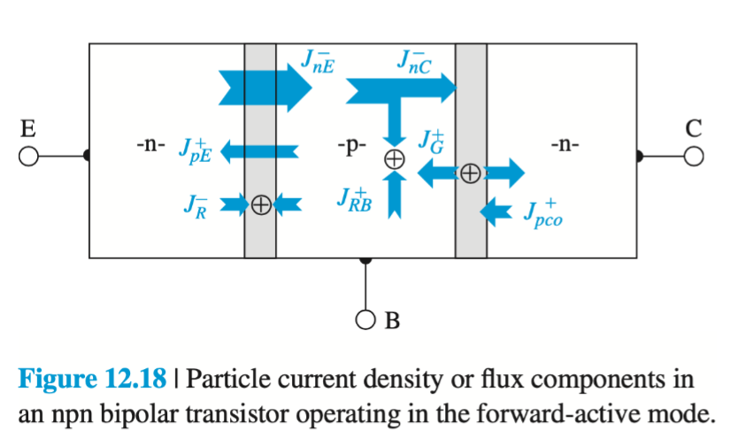

- Flow of current in [[BJT]]s
- 
- $J^-_{nE}$ is the electron flux from the emitter to the base
- $J^-_{nC}$ is the electron flux that reaches the collector
- $J^+_{pE}$ is the hole flux injected from the base into the emitter
- $J^+_{RB}$ is the hole flux from base feeding [[Electron Recombination]]
- $J^-_{R}$ is electron/hole flux due to the recombination in the B-E [[Space Charge Region]]
- $J^-_{pco}$ is the hole flux due to generation outside the C-B [[Space Charge Region]]
- $J^+_{G}$ is electron/hole flux due to generation in the C-B [[Space Charge Region]]
-