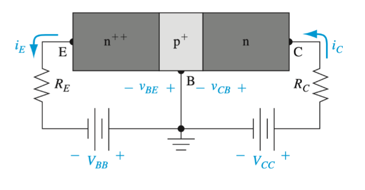
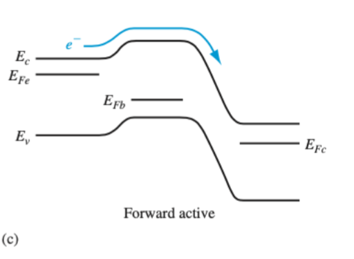

- A mode of [[BJT]]s
- Emitter junction is in forward bias while collector junction is in reverse bias
- In this mode the B-E is forward biased and the B-C is reverse biased
- Because the B-E junction is forward biased [[Electrons]] flow from the emitter to the base which means current flows from the base to the emitter
- if the [[Minority Carrier Diffusion Length]] $L_n$ is much larger than the base then [[Electrons]] can flow from the base into the collector which means current flows from the collector to the base
- 
- 
-
-