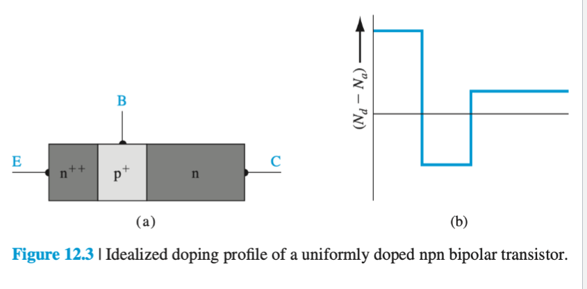
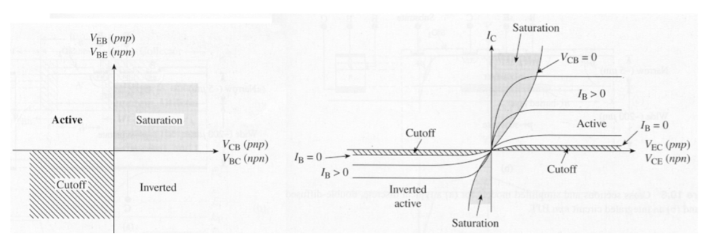

alias:: [[BJT]]

- It consists of two back to back [[Diode]] [[pn JUNCTION]]s (NPN or PNP)
- Three terminals
	- Emitter
	- Base
	- Collector
- The base separating the two diodes is very thin which means that the [[Minority Charge Carriers]] from the emitter are collected in the collector
- Current flows into collector and out of emitter
- Small $I_{in} \rightarrow$ Large $I_{out}$
- The base current is much smaller than the collector and emitter currents
	- Ratio is called the [[BJT Common Emitter Current Gain]] $\beta$
- In a good [[BJT]] the collector current is close to the emitter current
	- The Ratio is called the  [[BJT Common Base Current Gain]] $\alpha$
- The emitter region is doped the most while the collector region is doped the least
- Four Operating Modes
	- [[BJT Cutoff]]
	- [[BJT Forward Active]]
	- [[BJT Saturation]]
	- [[BJT Inverse Active]]
- The [[BJT Common Emitter Current Gain]] $\beta$ basically acts like a voltage amplifier
- Non-Ideal BJT Effects
	- [[BJT Early Effect]]
	- [[BJT High Level Injection]]
	- [[BJT Bandgap Narrowing]]
	- [[BJT Current Crowding]]
-
- {:height 358, :width 669}
- They have been replaced by [[MOSFET]]s in the past years because they have very high power draws
- 
- 
-
-
-