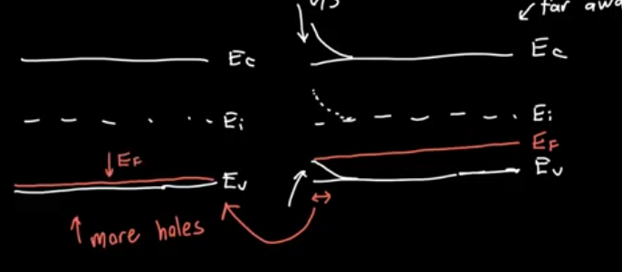

- When $$V_G<V_{FB}<0$$
- Accumulation layer of holes on the oxide semiconductor junction corresponding to the positive charge on the bottom plate of the MOS capacitor
- Near the interface we "accumulate" holes  which means the holes near the interface  are denser than the holes.
- **Negative** Voltage
- We need the Fermi level to be very close to the Valance band level so we must bend the band upwards which means that the $$-V>|\phi_{ms}|$$
-
- 
-
- 
-