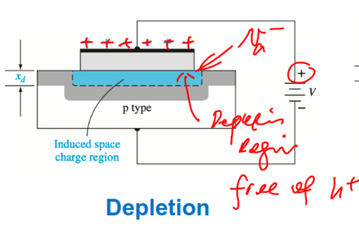
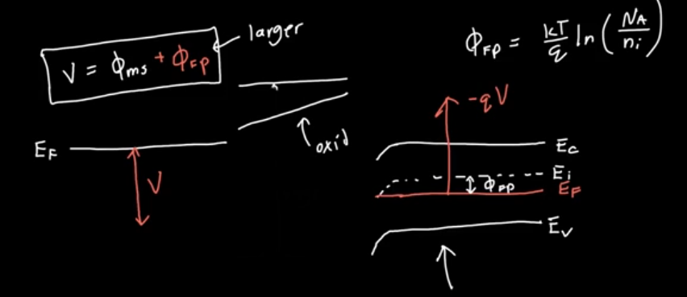

- Happens when $$V_{FB}<V_G<V_T$$
- When a voltage is applied to the gate Ex $$V_G =0.5\;V$$ for p-type
	- An electric field enters the substrate which pushes the holes away and forms a [[Space Charge Region]]
	- This also results in band bending
- Band Diagram
	- On the end of the semiconductor nothing really changes
	- [[Band Bending]] by a voltage results in  $$E_F\approx E_{Fi}$$ in the depletion region
	- Setting $$E_F\approx E_{Fi}$$ is the goal
	- This results in a voltage and a gap $$x_d$$
	- As we increase the voltage
		- Depletion region grows
		- Band bends more and earlier
		- Capacitance gets smaller
- 
- 
-
-