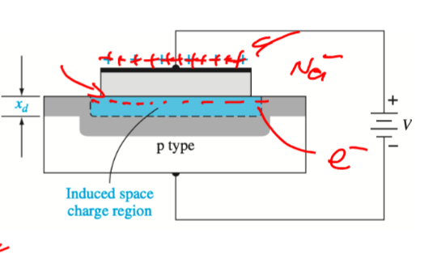

- Happens when $$V_T<V_G$$
- The surface in the [[Semiconductor]] adjacent to the oxide-semiconductor interface is n-type even though it is a [[p-type Semiconductor]]. This n-type layer is refereed to as an inversion layer
- When the Gate voltage gets passed a threshold it [[Band Bending]] so much that the $$E_F$$ becomes greater than the $$E_{Fi}$$
	- This results in the p-type material changing to an n-type material
- 
-