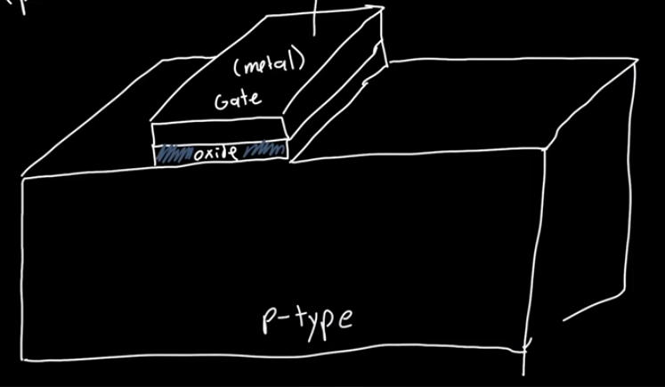

- Most widly used transistor
- Metal Oxide Semiconductor Field Effect Transistor
	- Metal Gate
	- Oxide Dielectric (Insulating Layer)
	- [[Semiconductor]] substrate (Two types)
		- p-substrate for n-channel NMOS
		- n-substrate for p-channel PMOS
	- This structure behaves like a chapacitor
- Gate Voltage $$(V_G) $$is applied to the metal
- The substrate (semiconductor part) is used as ground
- The amount the band bends $$\phi_{ms}$$ is equal to the metal work function minus the silicon work function
	- $$\phi_{ms}=\phi_m-\phi_s$$
	- $$\phi_s=\chi_{si}+(E_c-E_F)$$
	-
-
- Stages
	- [[MOS Capacitor Accumulation]] $$V_G<V_{FB}<0$$
	- [[MOS Capacitor Depletion]] $$V_{FB}<V_G<V_T$$
	- [[MOS Capacitor Inversion]] $$V_T<V_G$$
- 
-