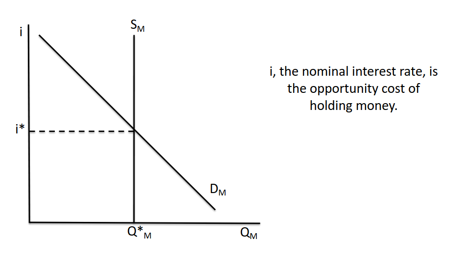

- A market for the [[Money Supply]], [[Money Demand]], against [[Nominal Interest Rates]]
- [[Open Market Operations]] can shift [[Money Supply]] which can change [[Nominal Interest Rates]]
- Increases in Income or prices will increase the [[Money Demand]] and increase nominal [[Interest Rate]]s
- 