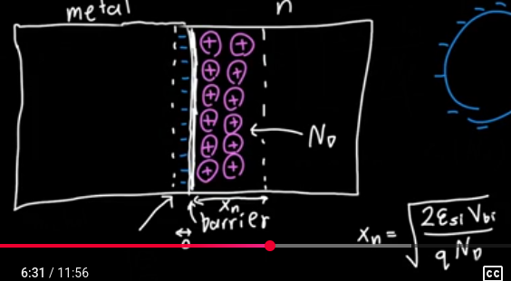

- Like a [[pn JUNCTION]] but only one side is actually a [[Semiconductor]] and the other side is a metal
- For metal Plus [[n-type Semiconductor]] we get
	- $$x_n=\sqrt{\frac{2\epsilon_{si}\Delta V}{qN_D}}$$
- 
-