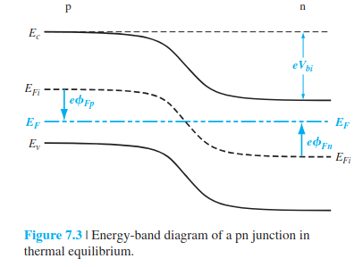

- Composed of a [[p-type Semiconductor]] region and an [[n-type Semiconductor]] region
- Where the two meet is a [[Space Charge Region]]
-  ![./P]
- Built in voltage $$V_{bi}=\frac{kT}{e}\ln(\frac{N_aN_d}{n_i^2})$$
- Forward voltage is when positive voltage is applied to the p-side.
	- This leads to the [[Space Charge Region]] shrinking
	- Applied forward voltage: $$V_a$$
	- [[Majority Charge Carriers]] dominate [[Drift Current]] so its large
	- Diffusion Capacitance dominantes
- Reverse voltage is when positive voltage is applied to the n-side
	- This leads to the [[Space Charge Region]] expanding
	- Applied reverse voltage is $$V_R$$
	- [[Minority Charge Carriers]] dominate [[Drift Current]] so its small
	- Depletion Capacitance dominates
	- Switching to reverse bias is slow
-